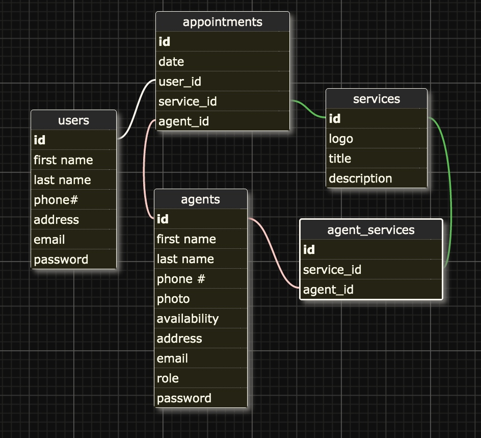

## Nine-badger Team
Majid
Mike
Yaseen
Nico

#### HTTP API

| action                             | CRUD   | verb | path                 |
| ----------------------------       | ------ | ---- | ---------------------|
| findUserByEmailOrcreateUser(userId)| create | post | /users/              |
| getUserById(userId)                | show   | get  | /users/:userId       |
| updateUser(userId, attrs)          | update | post | /users/:userId       |
| setAppointment(attrs)              | create | post | /appointments        |
| deleteAppointment(apptId)          | delete | post | /appointments        |
| updateAppointment(apptId)          | update | post | /appointments        |
| getAllAppointments(userId)         | show   | get  | /appointments        |
| getFreeSlotsByServiceId(serviceId) | show   | get  | /freeSlots/:serviceId|
| services()                         | show   | get  | /services            |

<!-- LICENSE -->

 This work is licensed under a <a rel="license" href="http://creativecommons.org/licenses/by-nc-sa/4.0/">Creative Commons Attribution-NonCommercial-ShareAlike 4.0 International License</a>.

[mit-license]: https://opensource.org/licenses/MIT
